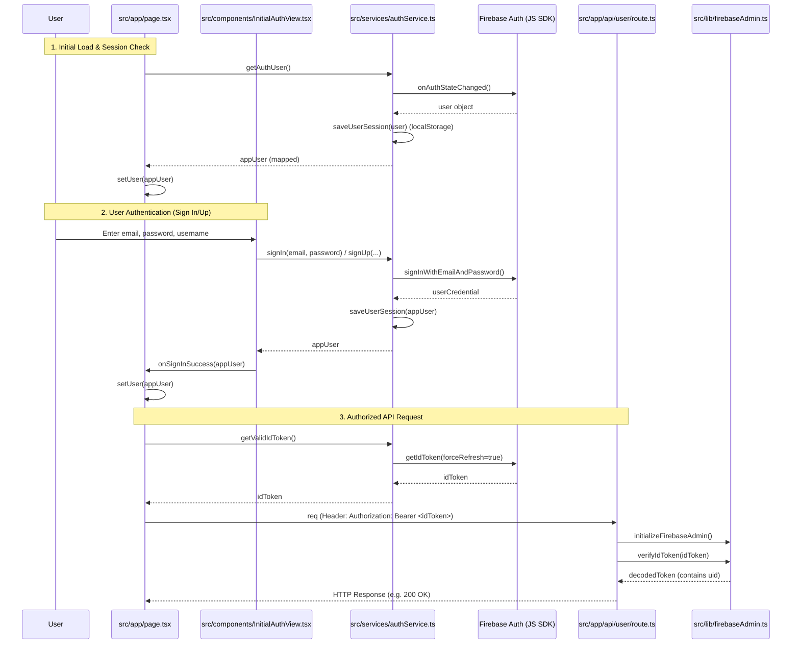

# Authentication Logic Diagram

This diagram explains the complete authentication lifecycle in the project, from initial page load to secure API requests.

## Sequence Diagram

## Key Files and Functions

### 1. Client-Side Service: `src/services/authService.ts`
- **`getAuthUser()`**: Listens for auth state changes using the Firebase JS SDK and retrieves the current user.
- **`signIn()` / `signUp()` / `signInWithGoogle()`**: High-level wrappers for Firebase authentication methods.
- **`getValidIdToken()`**: Retrieves the Firebase ID token, which is required for authentication in backend requests.
- **`saveUserSession()`**: Persists the user object in `localStorage` under the key `genieUser`.

### 2. Main Page Logic: `src/app/page.tsx`
- **`useEffect` (Initial Load)**: Calls `getAuthUser()` to check for an existing session and updates the component's `user` state.
- **`handleSignInSuccess()`**: Updates the application state once a user has successfully authenticated.

### 3. Server-Side Verification: `src/app/api/user/route.ts` & `src/lib/firebaseAdmin.ts`
- **`initializeFirebaseAdmin()`**: Initializes the Firebase Admin SDK for server-side operations.
- **`verifyIdToken()`**: A method from `firebase-admin/auth` used within API routes to validate the token sent from the client.
