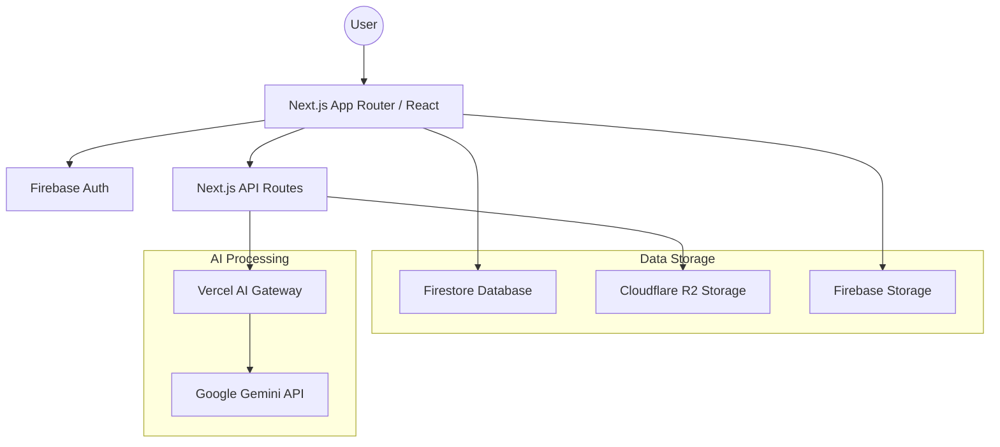
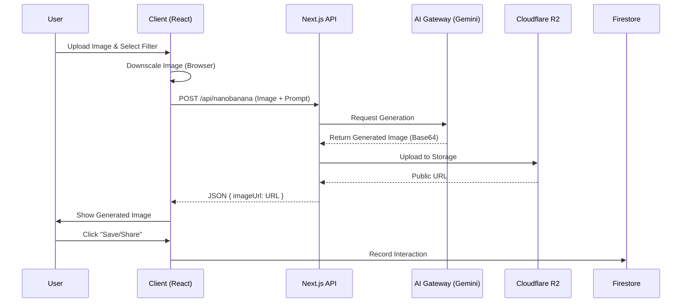
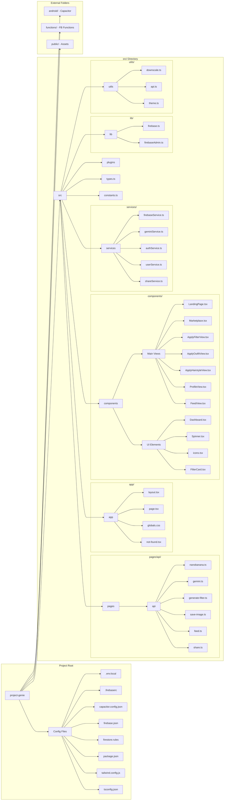

# GenAIe Application Documentation

GenAIe is an AI-powered image editing and generation platform that allows users to apply filters, merge outfits/hairstyles, and generate videos using Google's Gemini models.

## Architecture Overview

The application follows a modern serverless architecture integrated with specialized AI and storage services.

### Tech Stack
- **Frontend**: Next.js (App Router), React, Tailwind CSS.
- **Backend API**: Next.js API Routes (Pages directory style).
- **Authentication**: Firebase Authentication.
- **Database**: Firebase Firestore.
- **Core Storage**: Firebase Storage (for legacy/user uploads).
- **AI Image Storage**: Cloudflare R2 (S3-compatible).
- **AI Engine**: Google Gemini (Pro Vision / Pro Image) via Vercel AI SDK and AI Gateway.

### Technical Architecture Diagram

## Data Flow

### Image Processing Flow (Filtering/Merging)
1. **User Upload**: The user uploads an image in the UI (`ApplyFilterView`).
2. **Client-Side Processing**: The image is downscaled in the browser (`downscale.ts`).
3. **API Call**: The frontend calls a service (`geminiService.ts`), which hits an API route (`/api/nanobanana`).
4. **AI Processing**: The API route sends the image and prompt to the Gemini model through the AI Gateway.
5. **Storage**: The generated image is uploaded to Cloudflare R2.
6. **Result**: The public URL of the generated image is returned to the client and displayed.

### Data Flow Diagram

## Key Components

### 1. Main Entry Point (`src/app/page.tsx`)
The root page acts as a orchestrator, managing the application's visual state (`marketplace`, `apply`, `profile`, etc.) and handling initial data fetching (filters, outfits, hairstyles).

### 2. AI Services (`src/services/geminiService.ts`)
Encapsulates all AI-related logic, including prompt engineering with system instructions to ensure identity preservation and high-quality outputs.

### 3. API Routes (`src/pages/api/*`)
- `/api/nanobanana`: The primary engine for image-to-image and text-to-image generation.
- `/api/gemini`: Handles text-based generation and prompt improvement.
- `/api/save-image`: Handles direct uploads to Cloudflare R2.

### 4. Data Models (`src/types.ts`)
Defines the core entities:
- `Filter`: Prompt-based visual effects.
- `Outfit`: Stylized clothing to be merged.
- `Hairstyle`: Transferred hair styles.
- `Share/Post`: User-generated content shared with the community.

## Deployment & Infrastructure
- **Hosting**: Vercel.
- **Storage Configuration**: Environment variables are used for R2 endpoints and Firebase credentials.
- **Native Support**: Capacitor is integrated for Android/iOS builds, with specific plugins handle file saving on mobile.
## File Structure (Comprehensive)

